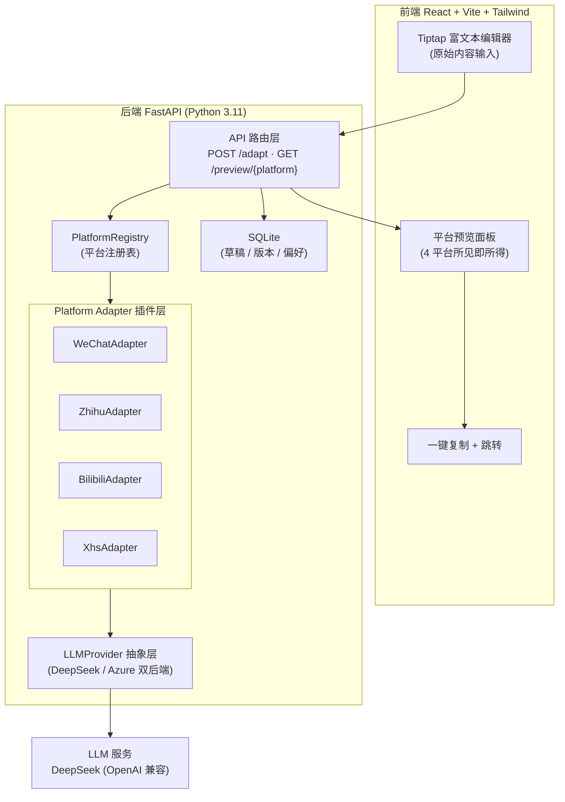
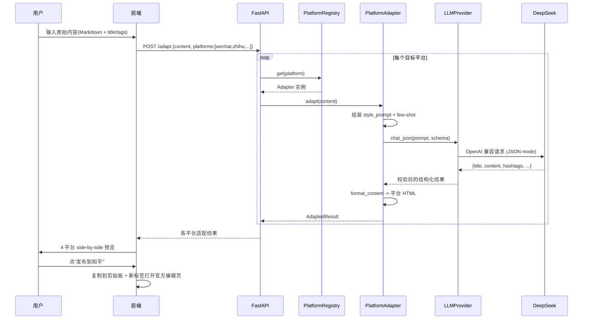
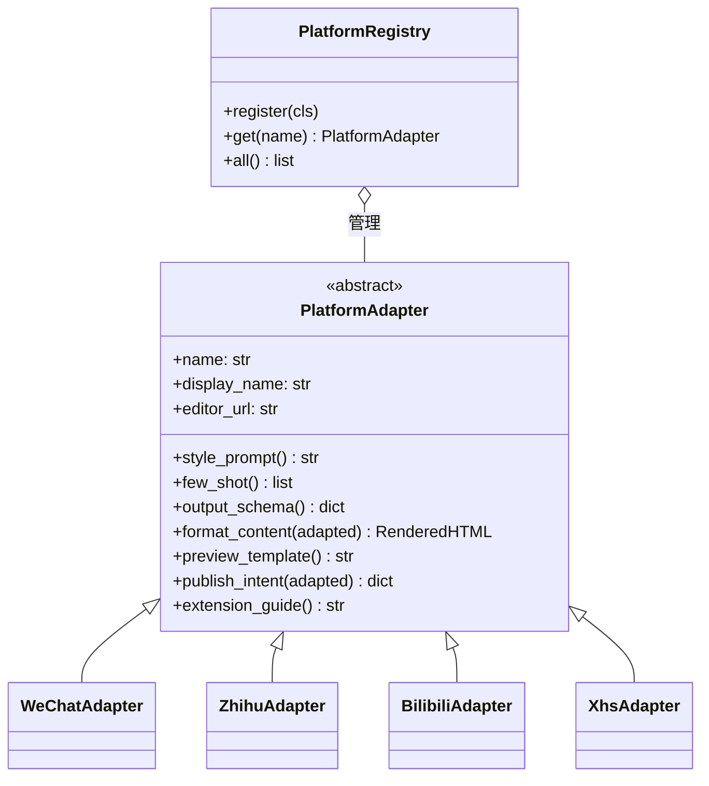
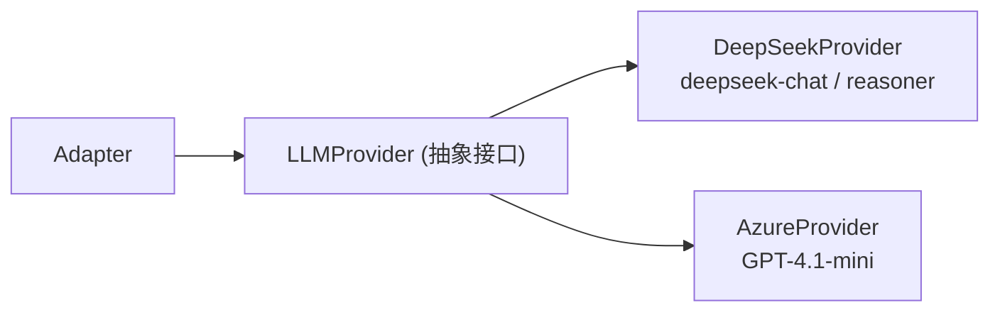
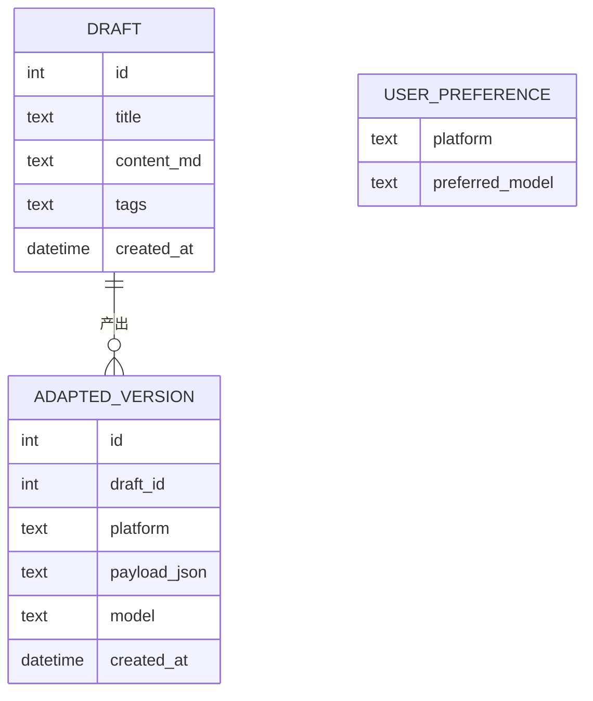
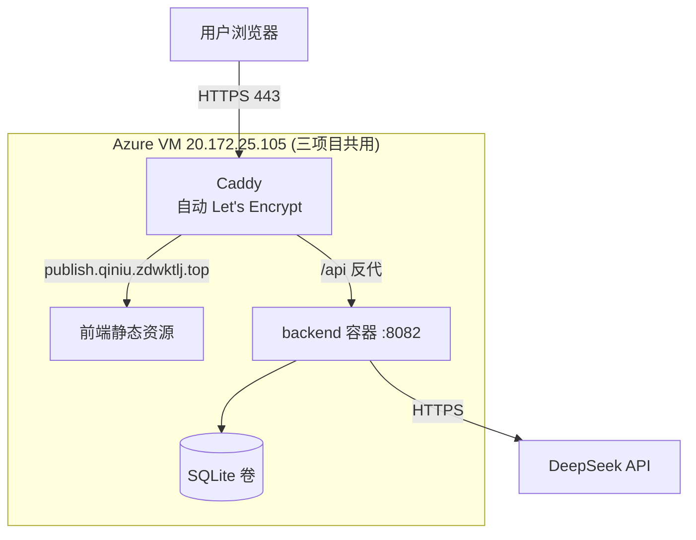

# 系统架构

> 多平台内容发布工具 · 架构设计文档
> 本文同时包含架构图（mermaid）与详细说明。扩展新平台的开发指南另见 [EXTENSION_GUIDE.md](EXTENSION_GUIDE.md)。

---

## 1. 设计目标与一句话定位

把"一份内容发到多个平台"从 ~30 分钟降到 ~3 分钟。

定位（见 [复盘.md](复盘.md) D-01）：**适配 → 预览 → 一键复制 → 跳转**，不做真发布。
因此整个系统的产出不是"调用平台 API"，而是"为每个平台生成一份风格本地化的内容 + 一个把它送进平台官方编辑器的闭环动作"。

三条设计主线：

1. **风格 ≠ 格式**：核心难点不是 markdown→html，而是同一篇内容在公众号/知乎/B 站/小红书呈现出**不同的语气、结构、互动话术**。这一层交给 LLM。
2. **平台可插拔**：新增平台不改核心代码，只实现一个 Adapter 并注册。这是题目原文要求的"扩展架构"，也是最大差异化点。
3. **诚实闭环**：最后一步永远是"复制 + 跳转到平台官方编辑页"，由用户在官方界面按下发布。

---

## 2. 分层架构

分层职责：

| 层 | 职责 | 不做什么 |
|---|---|---|
| 前端 | 输入、预览渲染、复制/跳转交互 | 不持有任何密钥，不直接调 LLM |
| API 路由层 | 接收请求、编排 adapter、流式返回 | 不写平台专属逻辑 |
| PlatformRegistry | 平台发现与查找（装饰器自动注册） | 不关心平台内部实现 |
| Platform Adapter | 每个平台的风格 prompt / 格式化 / 预览模板 / 跳转意图 | 不直接管理 HTTP/数据库 |
| LLMProvider 抽象 | 屏蔽不同 LLM 后端差异，提供统一 chat/json 接口 | 不含平台风格知识 |
| SQLite | 草稿、各平台输出版本、用户模型偏好 | 不存密钥 |

---

## 3. 核心数据流：一次"适配"请求

关键点：

- **逐平台独立适配**：各平台 adapter 互不依赖，可并发（后续可用 asyncio.gather 加速）。
- **JSON mode + schema 校验**：LLM 返回严格结构（title/content/hashtags/cover_alt），Pydantic 校验失败则重试，避免脏数据进前端。
- **最后一步在前端、在用户手里**：后端只产出内容与"跳转意图"，从不替用户发布。

---

## 4. Platform Adapter 插件化设计（核心亮点）

接口方法语义（最小集见 PR4 实现，最终签名记入复盘 D-04）：

| 方法 | 含义 | 必选 |
|---|---|---|
| `name` / `display_name` | 平台标识与中文显示名 | 是 |
| `editor_url` | 平台官方"写新内容"入口 URL（跳转目标） | 是 |
| `style_prompt()` | 该平台的风格适配系统提示词（语气/结构/互动话术规则） | 是 |
| `few_shot()` | 少量高赞内容风格样本（仅作 prompt 内风格学习，不入 git，见 D-06） | 否 |
| `output_schema()` | LLM 结构化输出的 JSON schema | 是 |
| `format_content()` | 把适配结果渲染成该平台可粘贴的 HTML/文本 | 是 |
| `preview_template()` | 该平台预览外观模板（CSS 仿真） | 是 |
| `publish_intent()` | 返回 `{clipboard, url}`，前端据此复制 + 跳转 | 是 |
| `extension_guide()` | 该平台的开发注意事项（字符限制、标签支持等） | 否 |

**新增一个平台的全部成本** = 写一个 `adapters/xxx.py`（约 100 行）+ 一行 `@register` 装饰器。
核心代码（路由层、registry、前端预览框架）零改动——这就是"5 行注册新平台"的工程兑现。

---

## 5. LLM Provider 抽象层

- 统一接口：`chat(messages)` 与 `chat_json(messages, schema)`。
- 双后端的意义：① 主用 DeepSeek（便宜快）；② Azure 备用做"多模型对比"亮点（同内容两模型适配，用户选优，偏好回流）。
- 切后端不改 adapter：adapter 只依赖抽象接口，后端由配置/请求参数决定。
- 对外接口：`GET /models` 按已配置 key 动态列出可用模型；`POST /compare` 对单平台用多个模型并发适配，返回各自结果与 `latency_ms`，支撑前端"多模型对比 + 偏好记忆"（亮点6）。
- **发布策略 Agent（创新）**：`POST /strategy` 收集所有平台的 `strategy_profile()`（定位档案）+ 用户内容，一次 LLM 调用给每个平台 0-100 契合度评分判断"该发哪些"；`POST /ideas` 调用 adapter 的 `generate_ideas()` 产出该平台原生标题/话题标签/封面文案。两者都建在 Adapter 架构上——新增平台写 `strategy_profile` 即自动进入打分，无需改 Agent。

---

## 6. 数据模型（SQLite，详见 PR10 落库）

- `DRAFT`：用户原始输入。
- `ADAPTED_VERSION`：每平台每次适配的结构化结果（含用哪个模型），便于对比与复用。
- `USER_PREFERENCE`：多模型对比中用户选择的偏好，下次同平台默认使用。

---

## 7. 部署拓扑（详见 PR14 / DEPLOY.md）

同机隔离约束（BRIEF §3.4）：本项目固定 **8082 端口** + 独立目录 `/opt/multi-publish/`，
经子域名 `publish.qiniu.zdwktlj.top` 由 Caddy 分流，不与另两个项目冲突。
**剪贴板 API 必须 HTTPS**（`navigator.clipboard` 在 HTTP 下被禁），这正是用 Caddy 自动证书的硬需求。

---

## 8. 架构层面预留的扩展点

| 扩展点 | 怎么扩展 |
|---|---|
| 新平台 | 实现 Adapter + `@register`，核心代码零改动 |
| 新 LLM 后端 | 实现 LLMProvider 子类，adapter 无感 |
| 风格热更新 | few-shot 样本与 style_prompt 在 adapter 内，可独立迭代 |
| 多模型对比 | LLMProvider 抽象天然支持同内容多后端并行 |
| 批量发布 | 路由层已按"内容 × 平台列表"组织，扩展为多内容是平行循环 |

---

## 9. 关键技术取舍速查（详见复盘.md）

- D-01 不做真发布 → 定位适配+复制+跳转
- D-02 FastAPI（async + Pydantic + openai-python）
- D-02b monorepo（backend + frontend）
- D-04 Adapter 接口最小集（PR4 拍板）
- D-05 风格适配 prompt（few-shot + JSON schema 约束）
- D-11 Caddy 自动 HTTPS（剪贴板 API 硬需求）
